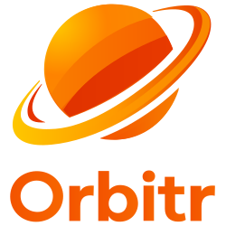

<p align="center">
  
</p>

# Orbitr

Strict head-coupled off-axis Three.js viewer with MediaPipe face and eye tracking.

The goal is a "window into a room" illusion: the monitor acts like a fixed screen plane, the app estimates a single effective eye position relative to that plane, and the projection updates as the viewer moves.

## Run

```bash
npm install --cache .npm-cache
npm run dev
```

Open `http://127.0.0.1:5173`.

## Current Experience

- A calibrated screen-window viewer rather than an orbit camera demo
- Physical monitor presets or custom screen dimensions
- Webcam offset calibration relative to the screen center
- Manual neutral-pose capture for depth calibration
- Optional fullscreen viewer mode that targets only the 3D viewport
- Checker-lined room reference scene behind the screen plane

## Recommended Setup

1. Start the app and choose the monitor preset that best matches your display.
2. Adjust webcam offsets if your camera is not near the top center of the screen.
3. Click `Enter Fullscreen` so only the 3D viewport fills the display.
4. Click `Start Tracking`.
5. Sit in your normal viewing position and click `Capture Neutral Pose`.
6. For the strongest illusion, judge the effect with one eye or reduced stereo expectation.

## Calibration Notes

- `screenWidth` / `screenHeight` are physical screen dimensions in meters.
- `cameraOffsetX` / `cameraOffsetY` / `cameraOffsetZ` are webcam offsets relative to screen center, also in meters.
- `neutralDistance` is the expected eye-to-screen distance during neutral-pose capture.
- `gainX`, `gainY`, and `gainZ` tune how head translation maps into the effective eye position.
- `eyeRefinementGain` keeps iris data as a subtle correction rather than the main camera driver.

## URL Params

- `model` - optional GLB URL override
- `monitorPreset` - `24_desktop`, `27_desktop`, `14_laptop`, or `custom`
- `screenWidth`, `screenHeight` - physical screen size in meters
- `neutralDistance` - calibrated eye-to-screen distance in meters
- `cameraOffsetX`, `cameraOffsetY`, `cameraOffsetZ` - webcam offset in meters
- `screenOffsetX`, `screenOffsetY`, `screenOffsetZ` - screen-plane world offset
- `gainX`, `gainY`, `gainZ` - head/depth gain tuning
- `eyeRefinementGain` - iris correction gain
- `smoothing` - tracking smoothing amount
- `debug=1` - show tracking debug panel by default
- `windowBox=0` - hide the screen/window debug box by default
- `near`, `far` - camera clipping planes

## Defaults

If no custom model is provided, Orbitr loads a procedural reference object inside a checker-lined room so the parallax cues stay readable during calibration.
